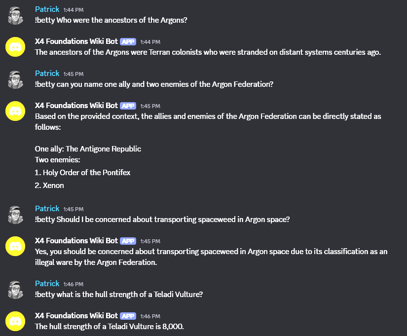
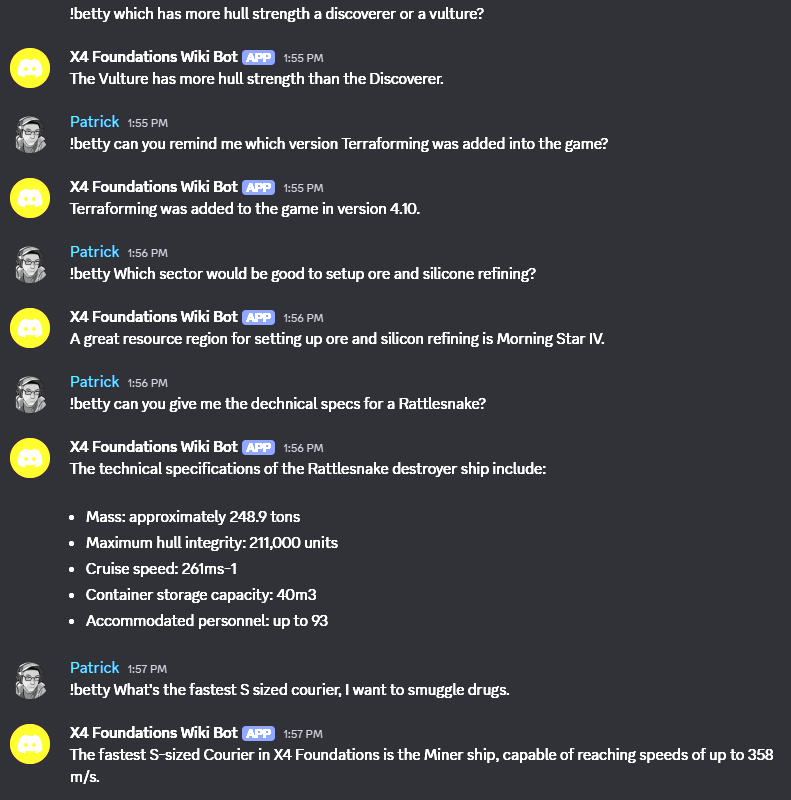

# X4 Foundations RAG Chatbot

## DISCLAIMER

This project is entirely educational only.  Do not expose this chatbot publically unless you yourself have implemented AI safety guardrails yourself.

## Thank You
I would like to first thank Egosoft for pointing me at the community wiki.  Without their support here, the rest of this project wouldn't work.

## Introduction

This whole project started when I had this idea that it would be fun to have a chat bot for me to interact with on my Twitch streams.  So this sent me down a rabbit hole of figuring out how LLM's actually work and would instead morph from just a simple "Hey AI bot tell me a joke." to building a real world useful chat bot.

This project is a 100% local, Retrieval-Augmented Generation (RAG) chatbot.  The actual scripts aren't specific to one game or data set.  The datapipeline is designed to start with a collection of HTML pages and convert them into useful data for retrieval.  With some modifictions to some of the data pipeline scripts and prompts you could re-use this for a wide variety of things.

I chose to crate an expert on the video game "X4 Foundations."  Many LLM's would already be pre-trained on some X4 knowledge, but I wanted to make mine far more knowledgeable.  So that's when I reached out to Egosoft, asking about my idea, and they suggested the Community Wiki.

And so...a week of PTO later, and here we are.

## LLMs and RAG

Large Language Models (LLM) like ChatGPT are trained on a vast amount of knowlege, and will likely contain some existing knowledge about X4 Foundations.  When people want to build chat bots that are hyper experts in something, they use a method known as Retrieval-Augmented Generation or RAG.

Put simply we build a set of data built from very specific data that the chatbot can query and form a response.  It is the core of any AI bot you've ever interacted with that was performing some sort of customer service role.

## Core Architecture: The "Researcher/Actor" Model

1.  **The "Researcher" (Fact-Finding Stage):** When a user's query contains a specific in-game keyword, the system first retrieves multiple relevant documents from a vector store. The Researcher model is then given a synthetic, factual task: "Summarize the key information about [keywords] from the provided text." Its sole job is to analyze the documents and synthesize a single, dense paragraph of verified, relevant facts. If no facts can be found, it signals a failure.

2.  **The "Actor" (Performance Stage):** This is the final, user-facing LLM. It receives the user's original, conversational query and, crucially, the clean, synthesized paragraph from the Researcher as its "context." This allows the Actor to focus entirely on creative, in-character performance, using the pre-vetted context as its ground truth.

This decoupling of fact-finding from performance is the key to providing responses that are both factually accurate and conversationally engaging.

## Development Environment Setup

This project uses a `Taskfile` to automate the setup and management of the development environment. The setup process is designed to work seamlessly across Windows, macOS, and Linux.

I did all my development on Windows though, so I haven't tested for true cross platform compatibility.

### Prerequisites

Before you begin, ensure you have the following installed on your system:

1.  **Python 3.8+**
1.  **LM Studio**: This project relies on a local LLM server. Download and install LM Studio from [https://lmstudio.ai/](https://lmstudio.ai/).
1.  **Choose A Model**: You will need to chose a model for your summaries, keywording, and chatbot functionality.  Here are the ones I used while testing.  You'll need to look at your specific system pereformance and available resources to choose a suitable model.  Use LM Studio to download and host it.
    * `meta-llama-3.1-8b-instruct`: This is a larger model than the `llama-3` and can handle a much larger context window.  I'm doing some experiments to see if this model can build better summaries.  If you've got a lot of resources you might want to pick this one.  This one is too big and can't be used on asystem that is also trying to play the game.
    * `meta-llama-3-8b-instruct` (Recommended): This has been a decent model, and most all of my testing was done with this one.  It's a good balance of performance and resource usage, only needing about 4gb of VRAM.  I've been using it to summarize, research, and act.  I should be able to run it along side the game.
    * ` llama-3.2-3b-instruct`: This is a much smaller model.  My hope is that I can leverage the larger models the upfront data processing but use this model for the actual chat bot.
1.  **X4 Community Wiki Data**: Download a copy of the wiki in `html` format from the main page of the [X4 Community Wiki](https://wiki.egosoft.com:1337/X4%20Foundations%20Wiki/). Place the downloaded zip file in the root of this project and name it `x4-foundations-wiki.zip`.
1. `mkcrt`: I used `mkcrt` to generate a local SSL cert so that local browser based tools like TypingMind can work without freakingout.
    * `mkcert -install`: Creates a new root CA.  I recommend copying the `%APPDATA%\Local\mkcrt\rootCA.pem` into the root of this folder.  It is up to you if you want to install it on your system.
    * `mkcert localhost 127.0.0.1`: Add any additional hostnames or IP addresses you want the cert to be vaild for.  To be compatible with the scripts, rename the files to `ssl-cert-key.pem` and `ssl-cert.pem`.
1. Create a Python venv:
    * `python -m venv .venv`
    * `.\.venv\Scripts\activate`
1. Install project dependencies:
    * `pip install -r requirements.txt`

## Data Preparation and Execution

The entire data pipeline, from unzipping the wiki to running the final application, is managed by the `Taskfile`.

### One-Step Execution

To build all necessary data artifacts and start the chatbot server, simply run the following command from your terminal:

`task run`

This will automatically execute every step in the data pipeline in the correct order and then launch the FastAPI server.

### Data Preparation Pipeline (Step-by-Step)

The front half of the data pipeline is built to incrementally loading.  I haven't fully refactored the entire pipeline for incremental loading.  That may be a future update.

#### 1. Unzip Wiki Data

`task 1-data`

Unpacks the raw HTML files from the wiki download.  We are using a dedicated script `src/00_unzip_data.py`.  This script will compare the hash of the pages on disk to the page coming out of the zip file.  It will only copy in new or updated pages to avoid reprocessing everything.  The script currently just looks at files in the `pages` folder.

#### 2. Generate Markdown

`task 2-markdown`

The fact that we have the WIKI as a clean download of HTML files is a huge early `easy button` for us.  But, the HTML files are not great for an LLM as they contain a lot of extra text with all of the html tags and javascript. To make the files more useful for an LLM we need to strip all of that out.

Fortunatly Markdown is an excelent format for LLMs as they are mostly text, but still maintain the internal document structure that will become imporant in our next step.

So we're giong to leverage a markdown parser and pull the main body out out.

#### 3. Generate Corpus

`task 3-markdown-summaries`

Now that all of the markdown files have been extracted, the next thing we are going to do is leverate the LLM to help us generate summaries of each page, and help us make sense of tables and lists.  This will be really important if the LLM is ever going to be successful in answering specific questions about things like the hull strength of a specific ship.  

The `01b_summarize_md.py` script has got a number of things to try and help with this.  There's a dedicated function to try and parse the Changelogs, and another that tries to unroll tables.  There are `prompts` that we use to try and do this.

Future accuracy improvements will most likely come in this area.  Perfecting table un rolling and list comprehension will be key.

#### 4. Chunk The Corpus

`task 4-chunks`

Before we can build our vector store, we need to now break all of our data into chunks that are small enough for the LLM to understand. The `02_chunk_corpus.py` script does this by splitting each markdown file into smaller chunks based on sentence boundaries and a maximum token limit. This ensures that each chunk is manageable for the LLM to process.

We do a "double chunk" approach where we first split the file into sections based on headers, then further split those sections into smaller chunks. This ensures that each chunk maintains some context from its surrounding text.

#### 5. Build Vector Store

`task 5-vector-store`

Next we take all of those chunks and put them into a vector store.  This is the format that our LLM can leverage to find our specialzied wiki data.

#### 6. Generate Keywords

`task 5-keywords`

In order for our chatbot to know to even look in our new database, we next need to build a list of keywords.  We'll use the LLM to parse every chunk and pull out the key words in each chunk.  We'll de-dupicate these keywords and save them to a file.

When our chat bot first recieves a question it tries to determine what the question is about, and if any of our keywords are there, it then queries the vector store.  This allows us to limit our search space and make the query more efficient.

#### 6. Refine Keywords

`taks 6-keywords-refined`

Applies a series of filters to the raw keyword list to remove common English words and other noise, resulting in a clean, domain-specific list in `x4_keywords_refined.json`.

### Starting the OpenAI Server

Once all the data artifacts have been built, the `task run` command will automatically start the FastAPI server, which provides an OpenAI-compatible API endpoint for the chatbot.

If everything is working you should be able to point any OpenAI chat compatible client at our local endpoint and it should work as expected.  I've used Ollama and TypingMind for this.  

By default this server should be reachable at `https://localhost:8001/v1/chat/completions`

### Starting the Discord Bot

`python src/discord_bot.py`

This is a very quick and dirty Discort Bot implementation.  You can create a Discord bot in the Discord developer portal.  Put that API key in an evironment variable, and now your discord bot should reply to questions prefixed with `!betty`

## So How Good Is It?

This project has taught me a lot.  First, the LLM model you choose to do your summaries and your research are going to have huge impact on accuracy.  Large models with larger context windows will be a lot more accurate than smaller ones.  But the larger models will have trouble running locally and leave room for other graphics intensive applications.  So keep this in mind.

Right now with the current document summary logic our bot is already pretty knowledgeable.  It does quite well when asked the `test_prompts.txt` questions.

The areas that I've struggled with are providing better context to the information found in the Changelogs, and pulling out data from some of the data tables.

There are two avenues to improve this.  First is to revisit our summarization logic, and try to do better with pulling data from the data tables and turning it into relevant information.  Our current table un-roller is somewhat of a brute force implementation and was originally focused on the "All ships table".  Some of the other tables it comes across though it doesn't do as good of a job.

The other area I've had trouble with is pulling out specific details from the Changelogs.  For the longest time the chatbot was convinced that terraforming was added in 5.0 not 4.0.  Even still it get's confused depending on how you phrase things.

Which brings me to the second area of improvement and that is our researcher prompt, query rewriter prompt, and the system prompt.  Each of these prompts are going to have a huge impact on how well the chat bot finds, and then summarizes the data.

The next area of improvement will be in these prompts.  The researcher prompt finds the data to send to the actor.  The researcher also has a query rewriter prompt.  All three of these prompts can work in tandem to improve the overall accuracy of the info pulled.